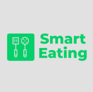

# SmartEatingApp

 

SmartEating es mi proyecto final de grado superior y busca organizar de forma eficiente los platos y comidas semanales o mensuales en un restaurante o ámbito personal. Su objetivo es optimizar la planificación de menús, facilitar la gestión de ingredientes y reducir desperdicios y costes.

# Tecnologías utilizadas

## Backend

- Python
- Django  
- Django Rest Framework  
- Djoser

## Frontend

- HTML
- CSS
- Vue.js  
- JavaScript  
- Tailwind CSS
